# Nextcloud Enterprise Helm Chart (Nextcloud + Collabora + Redis + MinIO + ClamAV + Notify Push + HPA)

A production-grade Umbrella Helm Chart and Kustomize package for deploying Nextcloud with Collabora Online Office, Redis session/locking, MinIO S3 object storage, Notify Push WebSockets, Preview Pre-generator, ClamAV Real-time Antivirus, and Horizontal Pod Autoscaling.

---

## 🏛️ Infrastructure Architecture (Mermaid Diagram)

```mermaid
flowchart TD
    User(["🌐 Client / Browser / Desktop & Mobile App"])

    subgraph Edge ["🛡️ Ingress & Edge Routing (Traefik Gateway)"]
        Traefik["Traefik Ingress Controller\n(Port 80/443 + Let's Encrypt TLS)"]
        SecHeaders["Middleware: Security Headers\n(HSTS 31536000s, Nosniff, SAMEORIGIN)"]
        DAVRewrites["Middleware: Regex Rewrites\n(CalDAV, CardDAV, WebFinger, NodeInfo)"]
        Traefik --- SecHeaders
        Traefik --- DAVRewrites
    end

    subgraph CoreStack ["☁️ Kubernetes Namespace: nextcloud-system"]
        subgraph AppLayer ["Web & Application Workloads"]
            NC["Nextcloud Pod (PHP 8.5 / Apache)\n• OPcache 256MB / 30k files\n• APCu In-Memory Cache\n• Theme: Unity Drive"]
            Collabora["Collabora Online Office (CODE)\n• Jailed Bind Mounting (SYS_ADMIN)\n• Warm Pre-spawned Children (2)\n• Hardware Concurrency (2 Cores)"]
            Push["Notify Push Daemon (Rust)\n• Persistent WebSocket Stream (/push)\n• Instant File & Chat UI Sync"]
            ClamAV["ClamAV Antivirus Daemon\n• Real-Time File Stream Inspection\n• Auto Freshclam Virus Definitions"]
            Cron["Preview Generator CronJob\n• Pre-renders High-Res Thumbnails\n• 60 FPS Fluid Gallery Scrolling"]
        end

        subgraph DataLayer ["Stateful & Caching Infrastructure"]
            Redis["Redis Master (Standalone)\n• Distributed Locks & Memcache\n• Pub/Sub for WebSockets"]
            Postgres["PostgreSQL 17 Primary\n• Relational Metadata Storage\n• Persistent Longhorn Volume (8Gi)"]
            MinIO["MinIO S3 Object Storage\n• Primary File Storage (nextcloud-data)\n• Persistent Longhorn Volume (20Gi)"]
        end
    end

    %% User Ingress Traffic
    User -->|"HTTPS / HTTP2"| Traefik
    Traefik -->|"Path: /"| NC
    Traefik -->|"Path: /push (WebSocket Upgrade)"| Push
    Traefik -->|"Host: office.sengporkeat.com"| Collabora
    Traefik -->|"Host: minio.sengporkeat.com"| MinIO

    %% Internal Communication & Protocols
    NC <-->|"TCP 6379 (Locking & Caching)"| Redis
    NC <-->|"TCP 5432 (SQL Queries)"| Postgres
    NC <-->|"S3 API (Port 9000)"| MinIO
    NC <-->|"WOPI Protocol (Port 9980)"| Collabora
    NC -->|"TCP 3310 (Real-Time File Scan)"| ClamAV
    Push <-->|"Pub/Sub Updates"| Redis
    Push <-->|"Direct DB Queries"| Postgres
    Cron -.->|"Executes 'preview:pre-generate' (Every 15m)"| NC

    classDef edge fill:#326ce5,stroke:#fff,stroke-width:2px,color:#fff;
    classDef app fill:#7D54D3,stroke:#fff,stroke-width:2px,color:#fff;
    classDef storage fill:#008080,stroke:#fff,stroke-width:2px,color:#fff;
    class Traefik,SecHeaders,DAVRewrites edge;
    class NC,Collabora,Push,ClamAV,Cron app;
    class Redis,Postgres,MinIO storage;
```



---

## 🌟 Key Features & Enterprise Capabilities

* **⚡ Ultra-Low Latency Notify Push (WebSockets)**: Dedicated Rust WebSocket microservice (`icewind1991/notify_push`) reducing background HTTP requests by 80% with instantaneous UI updates across all clients.
* **🖼️ Preview Pre-generator**: Background Kubernetes CronJob pre-rendering photo/document previews to deliver 60 FPS smooth scrolling in galleries.
* **🛡️ ClamAV Real-Time Antivirus Protection**: Live stream inspection of every uploaded file rejecting malware and ransomware before storing to disk.
* **📄 High-Performance Collabora Office**: Fully integrated with warm process pre-spawning (`num_prespawn_children=2`), Linux jail bind-mounting, and suppressed server audit warnings.
* **🔒 A+ Enterprise Security**: Pre-configured Traefik middleware enforcing 1-year HSTS preloading, anti-clickjacking (`SAMEORIGIN`), XSS filtering, MIME sniffing protection, and WebDAV/WebFinger rewrites.
* **🚀 Turbocharged PHP & Memory Caching**: OPcache (256MB / 30,000 files), APCu in-memory cache, and Redis distributed session locking.
* **💾 MinIO S3 Object Storage**: Full S3 primary storage with automated bucket lifecycle management.
* **📈 Elastic Auto-Scaling (HPA)**: Kubernetes autoscalers for both Nextcloud web and Collabora Office workloads.

---

## 📁 Repository & Directory Layout

```text
nextcloud-helm-chart/
├── README.md                           # Documentation & architecture diagrams
├── charts/
│   └── nextcloud-helmchart/
│       ├── Chart.yaml                  # Umbrella chart metadata & upstream dependencies
│       ├── values.yaml                 # Master configuration (MinIO, HPA, Caching, SSL, ClamAV)
│       ├── assets/                     # Custom branding (logo.png, background.png, favicon.png)
│       └── templates/
│           ├── _helpers.tpl            # Template naming helpers & labels
│           ├── rbac.yaml               # ServiceAccount, Role & RoleBindings for background jobs
│           ├── security-headers.yaml   # Traefik Middlewares (HSTS A+, WebDAV, WebFinger)
│           ├── notify-push-deployment.yaml # High-performance Rust WebSocket daemon & IngressRoute
│           ├── preview-generator-cronjob.yaml # 15-minute background preview pre-rendering CronJob
│           ├── clamav-deployment.yaml  # ClamAV daemon microservice & ClusterIP service
│           ├── collabora-deployment.yaml # Collabora Online Office deployment & service
│           ├── collabora-hpa.yaml      # Collabora Autoscaler (Min: 1, Max: 4)
│           ├── minio-deployment.yaml   # MinIO Dual-Mode Deployment, PVC, Service & Ingress
│           ├── performance-configmap.yaml # APCu, Redis, & PHP OPcache configurations
│           └── theming-job.yaml        # Post-install hook automating apps, themes & branding
│
└── kustomize/
    ├── base/
    │   └── kustomization.yaml          # Base Kustomize manifest referencing the Helm chart
    └── overlays/
        ├── production/
        │   ├── kustomization.yaml      # Production overlay
        │   └── custom-values.yaml      # Production overrides (Postgres, Redis, MinIO, ClamAV)
        └── dev/
            ├── kustomization.yaml      # Dev overlay
            └── custom-values.yaml      # Lightweight Dev overrides (SQLite, single replica)
```

---

## 🚀 Deployment & Upgrades

### Deploy / Upgrade Production:
```bash
git pull
helm upgrade --install nextcloud ./charts/nextcloud-helmchart \
  --namespace nextcloud-system \
  --create-namespace \
  -f ./kustomize/overlays/production/custom-values.yaml
```

---

## 🔍 Verification & Health Checks

```bash
# Check all running pods, services, and cronjobs
kubectl get pods,svc,cronjob,ingress -n nextcloud-system

# Verify Nextcloud Core Integrity
kubectl exec -n nextcloud-system $(kubectl get pod -n nextcloud-system -l app.kubernetes.io/name=nextcloud -o jsonpath='{.items[0].metadata.name}') -c nextcloud -- su -s /bin/bash www-data -c "php occ integrity:check-core"

# Test ClamAV Antivirus Daemon
kubectl logs -n nextcloud-system pod/$(kubectl get pod -n nextcloud-system -l app.kubernetes.io/name=clamav -o jsonpath='{.items[0].metadata.name}') --tail=20

# Trigger Manual Preview Pre-generation
kubectl create job --from=cronjob/nextcloud-preview-generator preview-manual -n nextcloud-system
```
